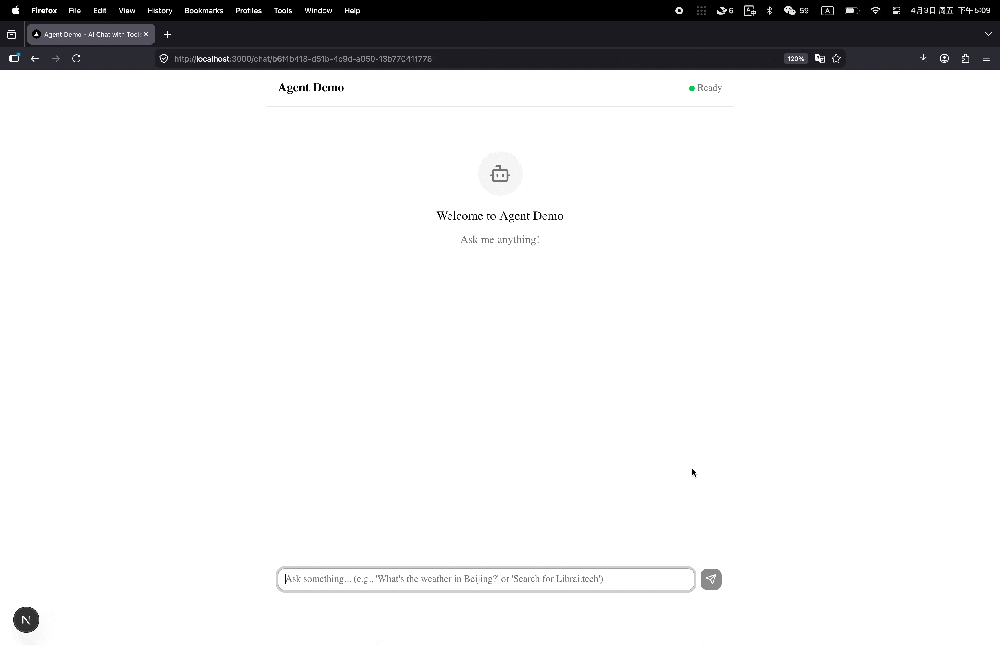
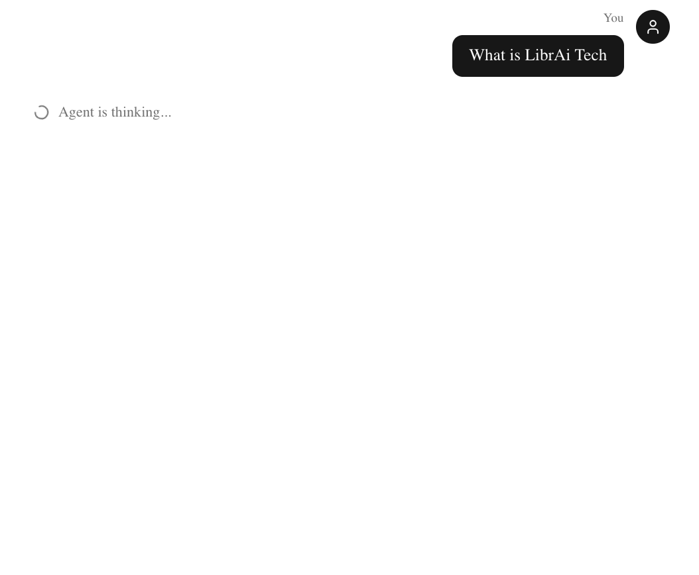
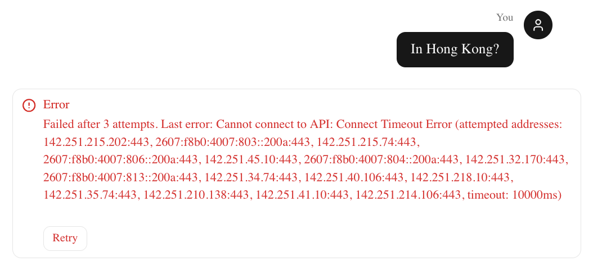
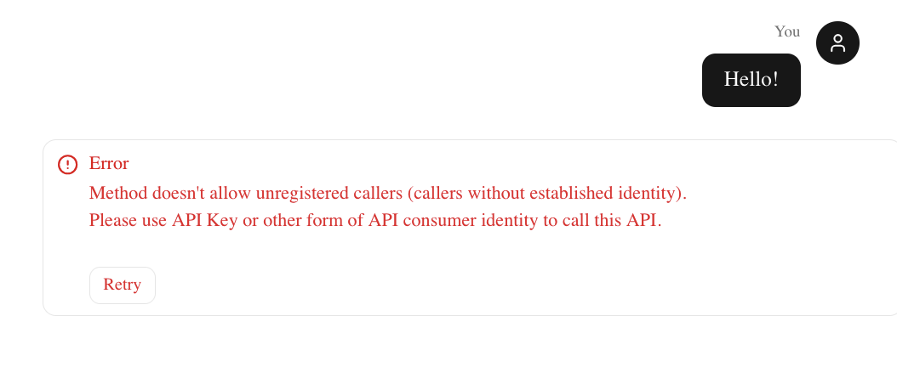
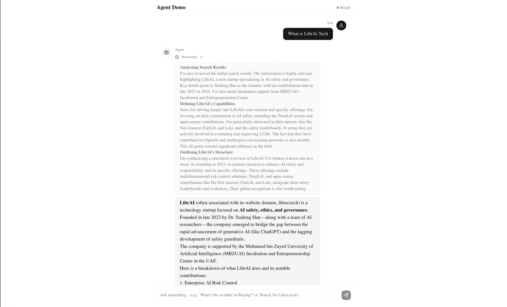
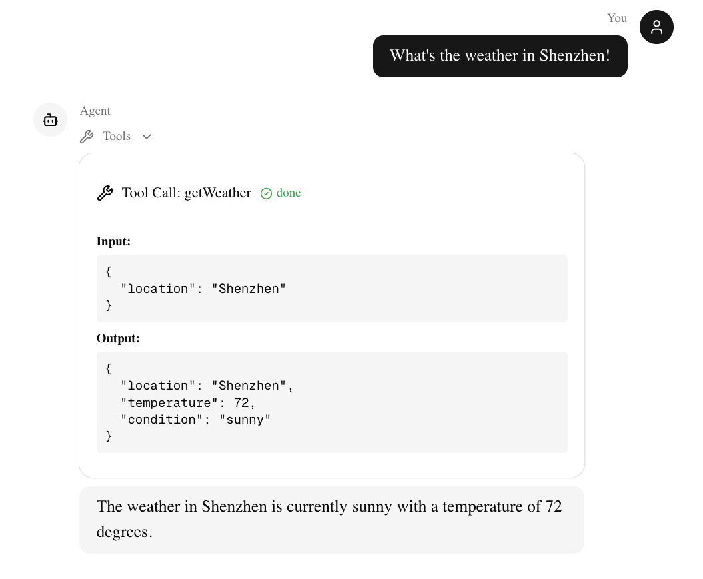

# librai-agent-demo

一个最小可用的 Agent Demo，使用 Vercel AI SDK 实现完整的用户请求处理流程（输入 → Agent 处理 → 返回结果）。利用：**框架**: Next.js 16 (App Router)，**Agent SDK**: Vercel AI SDK (`useChat`, `streamText`)，**LLM Provider**: Google Gemini，**UI**: shadcn/ui + Tailwind CSS，**语言**: TypeScript



*Note: UI 已放大以便更好地展示*

---

## 你使用了哪些 AI 工具

我使用了以下 AI 工具辅助开发：

| 工具                                                                                                                    | 用途                               |
| ----------------------------------------------------------------------------------------------------------------------- | ---------------------------------- |
| **Kimi 2.5** (通过 VS Code 扩展 [Kimi Code](https://marketplace.visualstudio.com/items?itemName=moonshot-ai.kimi-code)) | 项目架构设计、组件实现、问题调试   |
| **Gemini CLI** (gemini-3.0+的模型)                                                                                      | AI SDK 最新用法的实现、UI 细节优化 |

---

## 你如何使用 AI 工具完成这个任务

### 1. 技术选型与架构设计

在确定使用 Next.js + Vercel AI SDK + Google Gemini 的技术栈后，我使用 Kimi Code 的 Plan Mode 帮助设计了[项目架构](./architecture.md)。这包括：

- 目录结构设计
- 组件拆分策略 (chat.tsx → messages.tsx → message.tsx)
- API 路由设计
- 工具调用（Tool Calling）流程规划

### 2. 组件实现

> 其实正常来说，如果需要做复杂UI设计的话，我会利用v0.app去做页面设计，但是因为本任务比较简答，我就提供了一个参考图片，让gemini-cli直接生成UI，然后去微调

**Kimi Code 负责**：
- 项目初始化（shadcn/ui 配置、依赖安装）
- 基础组件骨架（multimodal-input.tsx、markdown.tsx）
- 整体布局和样式

**Gemini CLI 负责**：
- `route.ts` - AI SDK 服务端 streaming API 实现
- `chat.tsx` - 新版 `useChat` 钩子的正确使用
- `message.tsx` - UIMessage `parts` 解析逻辑

选择 Gemini CLI 的原因：在我发现 Kimi 的 AI SDK 用法有些过时后，Gemini CLI 能够更好地理解最新的 Vercel AI SDK v6 的 API 设计（如新的 `useChat` 钩子等，UIMessage 定义）。Kimi 其实也可以，但是需要进行多轮修正，多次提供console.log的输出，让 Kimi 了解 UIMessage 的架构。


为了确保代码使用最新 API，我向 AI 提供了以下官方文档链接：
- https://ai-sdk.dev/providers/ai-sdk-providers/google-generative-ai
- https://ai-sdk.dev/docs/reference/ai-sdk-ui/use-chat


## 哪些代码主要由 AI 生成，你做了哪些修改

### AI 生成的主要代码

| 文件                                   | AI 工具       | 说明                                                     |
| -------------------------------------- | ------------- | -------------------------------------------------------- |
| `app/api/chat/route.ts`                | Gemini CLI    | streamText 配置、工具定义、流式响应                      |
| `components/chat/chat.tsx`             | Gemini CLI    | useChat 钩子、消息发送逻辑                               |
| `components/chat/message.tsx`          | Kimi + Gemini | 基础结构由 Kimi 生成，UIMessage parts 解析由 Gemini 修正 |
| `components/chat/messages.tsx`         | Kimi          | 消息列表容器                                             |
| `components/chat/multimodal-input.tsx` | Kimi          | 输入框组件                                               |
| `components/chat/markdown.tsx`         | Kimi          | Markdown 渲染器                                          |
| `app/chat/[id]/page.tsx`               | Kimi          | 动态路由页面                                             |

### 我做的主要修改

1. **修正 AI SDK 用法**：将 Kimi 生成的旧版 `useChat` API（使用 `handleSubmit`、`isLoading`）更新为新版的 `sendMessage`、`status` 模式
2. **修复 Tool 类型**：修正 message.tsx 中 tool call 的类型判断逻辑，从 `tool-invocation` 改为 `tool-{toolName}` 格式
3. **替换图标**：将 AI 使用的 `Tool` 图标（lucide-react 中不存在）替换为 `Wrench`
4. **API 响应格式**：将 `toTextStreamResponse()` 改为 `toUIMessageStreamResponse();` 以支持 tool calling
5. **调整布局**：优化了消息气泡的宽度、滚动行为等 UI 细节

---

## 你在实现过程中遇到了什么问题，如何解决

### 问题 1: Vercel AI SDK 版本更新导致 API 不兼容

**现象**：
- Kimi 生成的代码使用旧版 API：`useChat` 返回 `handleSubmit`、`isLoading`、`messages` 等
- 实际安装的 `@ai-sdk/react` v3+ 使用新 API：需要 `sendMessage`、`status`、`DefaultChatTransport`

**解决方案**：
- 查阅官方文档确认最新用法
- 使用 Gemini CLI 重新实现核心逻辑
- 手动管理 input state（新版不再内部管理）

### 问题 2: UIMessage `parts` 结构理解错误

**现象**：
- AI 最初使用 `message.toolInvocations` 来获取工具调用
- 实际上新版 SDK 使用 `message.parts` 数组，tool call 的 type 是 `tool-{toolName}`

**解决方案**：
- 通过 console.log 打印实际数据结构
- 参考文档中的 UIPart 类型定义
- 重构 message.tsx 中的解析逻辑

### 问题 3: Lucide React 图标不存在

**现象**：AI 使用了 `Tool` 图标，但 lucide-react 中没有这个导出

**解决方案**：替换为 `Wrench` 图标

---

## 如何运行项目

**1. 安装依赖**

```bash
cd agent-demo/
pnpm install
```

**2. 配置环境变量**

```bash
cp .env.local.example .env.local
```

编辑 `.env.local`：

```env
GOOGLE_GENERATIVE_AI_API_KEY=your_google_api_key_here
```

获取 API Key: [Google AI Studio](https://aistudio.google.com/app/apikey)

**3. 运行开发服务器**

```bash
pnpm dev
```

访问 [http://localhost:3000](http://localhost:3000)

---

## 项目功能特性

### ✅ 基础功能
- 输入框、提交按钮、结果展示区域
- 后端 `/api/chat` API 接收用户输入并返回结构化结果
- 使用 Google Gemini 模型进行 AI 处理

### ✅ 加分功能

| 功能                          | 实现                                       | 截图                                                      |
| ----------------------------- | ------------------------------------------ | --------------------------------------------------------- |
| **Loading 状态**              | 显示 "Agent is thinking..." 和加载动画     |                             |
| **错误处理**                  | 显示错误信息并提供重试按钮                 |   |
| **历史记录展示**              | 保存并显示当前会话的所有消息（可滚动）     |                             |
| **结构化展示 Agent 中间信息** | 显示 tool call 的参数和结果                |                           |
| **真实 LLM API + Tool Call**  | Google Gemini + Google Search/Weather 工具 | -                                                         |

### 支持的 Tools

1. **google_search** - 使用 Gemini 的 search grounding 功能进行网络搜索
2. **get_weather** - 获取指定城市天气（Mock 数据）